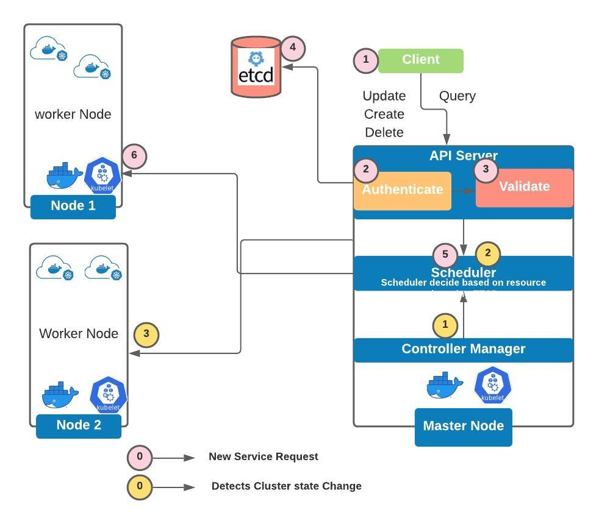

# kubernetes-mongodb-mongo-express

Deploy mongo and mongo express into Kubernetes and basic understanding of Kubernetes

### What is kubernetes ?

> Kubernetes is open-source-container-orchestration system for automatating computer application deployment, scaling and management.

### What are the important key componenets in Kubernetes?

- Cluster:
  > A Kubernetes cluster is a set of nodes that run containerized applications. Containerized applications packages an app with its dependences
  > and some necessary services.
  > Kubernetes clustes allow containers to run across multiple machines and environments: _virtual, phyical, cloud-based, and on-premises._
- Node:
- Pod
- MasterNode:

  > Master Node controls the state of the cluster. The master node is the origin for all task assignments.
  > It coorinates processes such as scheduling, scaling, cluster state, updates

  - kube-apiserver:
    > Exposes a REST interface to all Kubernetes resources. Serves as the front end of the Kubernetes control plane. like UI, CLI etc
    > It is kind of cluster gateway. Client intract with API server to Update/Query node. It acts as a gatekeepr for authentication.
    ```commandline
    Some Request -> API Server -> validates Request -> other processes.. -> Pod (Docker)
    ```
          
  - controller-manager:
    > Detects cluster state changes, like pods are down so it will schedule for new pods
    ```commandline
    controller-Manager -> Scheduler -> Kubelete.
    ```
                          
  - kube-scheduler:
    > scheduler has all the information about all nodes, it based on requirement or resources need, scheduler decide to which node need to install.
    ```commandline
    Some Request -> API Server -> validates Request -> scheduler -> Pod (Scheduler decide where to put the pods)
    ```
    
  - ETCD Server:
    > It's kind of Cluster brain where value store into Key Values. Cluster changes get stored in the key value store, like how many nodes,pods, CPU size, max
    > capacity etc. It's important because Controller-Manager, Scheduler sue the ETCD data to perform operation. Like what resources are available and did the cluster
    > state change.

- WorkerNode

  - _Kubectl_: Interacts with both - the runtime container and node. It give instruction to continer runtime to pull image from docker and run into pod.
  - _kube-proxy_:
  - _RunTime container like docker/rkt_ : conainer runtime need to install very node,




```commandline
kubectl get pods -n kube-system
NAME READY STATUS RESTARTS AGE
etcd-minikube 1/1 Running 5 223d
kube-apiserver-minikube 1/1 Running 5 223d
kube-controller-manager-minikube 1/1 Running 5 223d
kube-proxy-s8qpb 1/1 Running 5 223d
kube-scheduler-minikube 1/1 Running 5 223d
```


Some Request -> API Server -> validates Request -> other processes.. -> Pod (Docker)

How to start minikube ?

> minikube start

How to delete pods ?
```commandline
kubectl delete pods <pod> --grace-period=0 --force
```

how to delete deployment
```commandline
kubectl delete deployment myapp
```
```commandline
 minikube service mongo-express-service
 |-----------|-----------------------|-------------|---------------------------|
 | NAMESPACE | NAME | TARGET PORT | URL |
 |-----------|-----------------------|-------------|---------------------------|
 | default | mongo-express-service | 8081 | http://<ip-address>:30000 |
 |-----------|-----------------------|-------------|---------------------------|
```
kubectl apply commands in order
```commandline
kubectl apply -f mongo-secret.yaml
kubectl apply -f mongo-deployment.yaml
kubectl apply -f mongo-service.yaml
kubectl apply -f mongo-configmap.yaml 
kubectl apply -f mongo-express-deployment.yaml
kubectl apply -f mongo-service.yaml
```
kubectl get commands
```commandline
kubectl get pod
NAME                                 READY   STATUS    RESTARTS   AGE
mongo-deveployment-xxxxxx-xxxxx   1/1     Running   0          3h2m
mongo-express-xxxx-xxxx           1/1     Running   0          158m

kubectl get pod --watch
kubectl get pod -o wide
kubectl get service
kubectl get secret
kubectl get all | grep mongodb

```

Kubectl debugging commands
```commandline
kubectl describe pod mongodb-deployment-xxxxxx
kubectl describe service mongodb-service
kubectl logs mongo-express-xxxxxx
```

URL to external service in minikube
```commandline
minikube service mongo-express-service
```